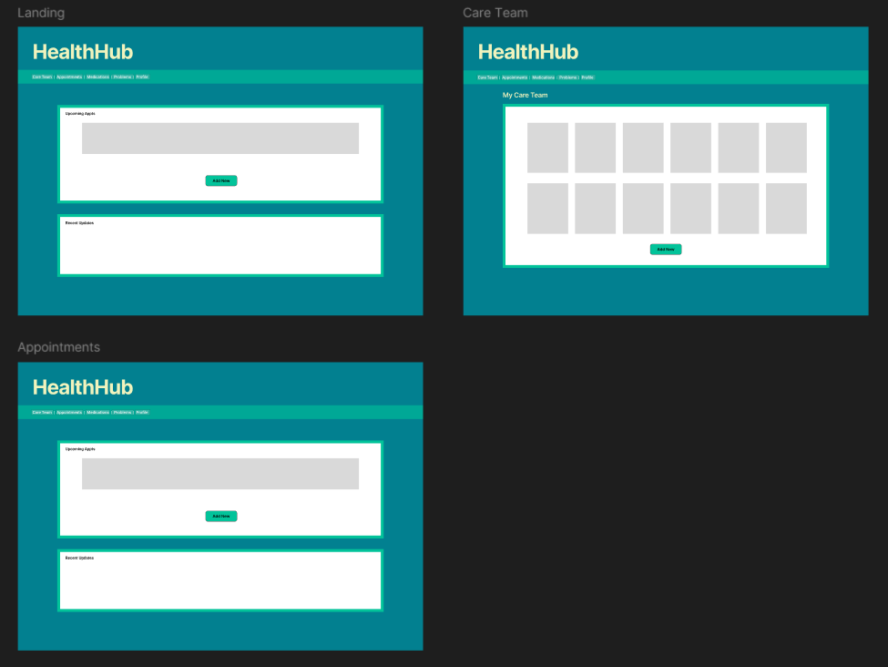
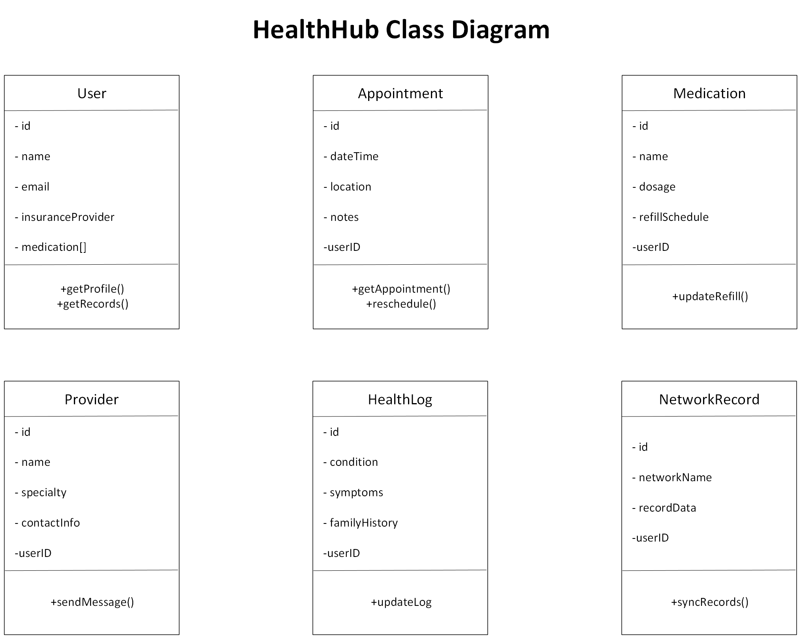

### Project Title: HealthHub
### Group Members: Deshyah Anderson, Ely Bush, Morgan Montgomery, Paul Morris, Kyle Rosa

**Project Overview**

HealthHub is an enterprise, patient-centric personal health management application designed to solve the data fragmentation caused by modern healthcare networks. Currently, major healthcare applications (such as MyChart) segregate patient medical records by specific hospital systems or regional networks. As a result, patients who visit doctors across different health networks must maintain separate login credentials, navigate multiple portal interfaces, and manually reconcile conflicting medical histories.

**Goals and Objectives**

**Eliminate Data Fragmentation:** Provide a unified platform where users can store and view healthcare data from multiple independent medical networks in one centralized database.
**Streamline Appointment Management:** Deliver an intuitive interface to log, track, and organize past and upcoming appointments along with personal visit notes.
**Maintain Medication Ledgers:** Empower users to track current and discontinued medications, custom dosages, and refill schedules without healthcare organization limitations.
**Centralize Care Team Records:** Create a universal provider directory that allows patients to record doctor contact details across networks and send direct messages to their care teams.
**Enable Dynamic Health Logging:** Provide structured tools for patients to document active health conditions, medical symptoms, and family health history for easy access during doctor visits.
**Implement Enterprise Architecture:** Build a scalable, multi-tier Spring Boot application leveraging layered architecture (`@Controller`, `@Service`, `@Repository`), Spring Data JPA, and responsive Bootstrap/Thymeleaf views.

**Functional Requirements:**

**Requirement 1:**

Given a user is registered with a medical network

When they log into the HealthHub application

Then they are able to view their healthcare data and schedule appointments.

**Requirement 2:**

Given the user has an upcoming appointment

When they log into the HealthHub application

Then they can see the appointment information and reschedule if necessary.

**Requirement 3:**

Given the user has been prescribed new medication

When they go into the medications tab within the application

Then they can see the medication information, expected shipment dates, and instructions on how to take it.

**Storyboard (Screen Mockups):**

**Class Diagram (UML):**

**Class Diagram Description:**

Short descriptions for each class:

**User:**

Represents the patient account and serves as the central entity connecting all other classes.
Stores personal details, insurance information, and references to medications, appointments, and providers.

**Appointment:**

Handles scheduling and tracking of medical visits.
Includes appointment details such as date, time, location, and notes.

**Medication:**

Manages user prescriptions, dosage information, and refill schedules.
Links directly to the user for personalized medication tracking.

**Provider:**

Represents healthcare professionals associated with the user.
Stores contact information and specialty details, enabling communication between patient and provider.

**HealthLog:**

Captures user‑entered health data, including conditions, symptoms, and family medical history.
Supports updates and tracking of ongoing health issues.

**NetworkRecord:**

Integrates external medical data from different healthcare networks.
Allows synchronization of patient records to unify fragmented data sources.

**Architecture and Components (Diagram):**

**Scrum Roles and Responsibilities:**

Product Owner:

Scrum Master: Ely Bush

Development Team:

**GitHub Project Link:**

https://github.com/ely-bush/IT4045_HealthHub

